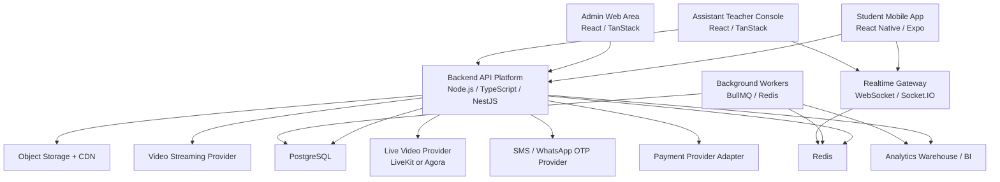

# Mutken MVP Technical Project Plan

Version: 1.0  
Date: 2026-07-07  
Related product document: [Mutken PRD](./mutken-prd.md)  
Product: Mutken student learning app  
Target platforms: Android, iOS, responsive web admin, responsive web teacher console

## Index

1. [Document Purpose](#1-document-purpose)
2. [Technical Executive Summary](#2-technical-executive-summary)
3. [Recommended MVP Architecture](#3-recommended-mvp-architecture)
4. [Technology Decision Summary](#4-technology-decision-summary)
5. [Core Backend Systems](#5-core-backend-systems)
6. [Mobile App Requirements](#6-mobile-app-requirements)
7. [Admin Area Requirements](#7-admin-area-requirements)
8. [Assistant Teacher View Requirements](#8-assistant-teacher-view-requirements)
9. [Content Repository and Curriculum CMS](#9-content-repository-and-curriculum-cms)
10. [Study Plan Recommendation System](#10-study-plan-recommendation-system)
11. [Resource Lesson Engine](#11-resource-lesson-engine)
12. [Points, Excellence Board, and Challenges Engine](#12-points-excellence-board-and-challenges-engine)
13. [Subscription, Payment, and Entitlement Engine](#13-subscription-payment-and-entitlement-engine)
14. [Live Session Platform](#14-live-session-platform)
15. [Assistant Teacher Chat System](#15-assistant-teacher-chat-system)
16. [Progress, Reports, and Analytics](#16-progress-reports-and-analytics)
17. [Notification and Communication Services](#17-notification-and-communication-services)
18. [Security, Privacy, and Compliance Requirements](#18-security-privacy-and-compliance-requirements)
19. [Infrastructure and DevOps Requirements](#19-infrastructure-and-devops-requirements)
20. [Database and Data Model Implementation](#20-database-and-data-model-implementation)
21. [API Requirements](#21-api-requirements)
22. [Testing and Quality Requirements](#22-testing-and-quality-requirements)
23. [MVP Timeline](#23-mvp-timeline)
24. [Team and Delivery Roles](#24-team-and-delivery-roles)
25. [Risks and Technical Decisions Needed](#25-risks-and-technical-decisions-needed)
26. [External Technical References](#26-external-technical-references)

## 1. Document Purpose

This document converts the Mutken PRD into a technical MVP delivery plan.

It defines:

- Backend systems that must be developed.
- Mobile app technical requirements for Android and iOS.
- Admin area requirements.
- Assistant teacher console requirements.
- Content repository and curriculum management requirements.
- Study plan recommendation requirements.
- Technology choices for each major system.
- A practical phased timeline.

This is not a UI prototype document. It is the engineering delivery plan needed to turn the prototype into a production-ready commercial MVP.

## 2. Technical Executive Summary

Mutken should be built as a modular product platform with these client surfaces:

1. Student mobile app for Android and iOS.
2. Admin web area for operations, content, subscriptions, payments, support, and reporting.
3. Assistant teacher web console for chat, recommendations, rewards, and live session control.
4. Backend API platform used by all clients.

Recommended MVP architecture:

- Start with a modular monolith backend, not microservices.
- Use PostgreSQL as the primary system of record.
- Use Redis for caching, rate limits, jobs, and realtime coordination.
- Use S3-compatible object storage plus CDN/video streaming for media.
- Use a rules-based recommendation engine first, then add AI/ML later.
- Use managed services for OTP, payments, video streaming, and live video where possible.
- Use event-based points and learning analytics from day one.

The current prototype is a React/TanStack/Vite web app. It should remain useful for product validation and admin-style web surfaces, but the production student app should be built as a real cross-platform mobile app.

Recommended mobile approach:

- React Native with Expo and TypeScript.
- Shared design tokens and business types with the backend where practical.
- Native builds for Android and iOS through EAS Build or equivalent CI.

## 3. Recommended MVP Architecture

### Architecture Style

Use a modular monolith for the first commercial MVP.

Reasoning:

- Mutken has many connected business rules: points, entitlements, progress, recommendations, payments, content, and subscription status.
- A modular monolith keeps transaction boundaries simpler.
- It avoids premature microservice complexity.
- Modules can later be extracted when usage or team size justifies it.

### High-Level Architecture



### Deployment Environments

Minimum environments:

| Environment | Purpose |
| --- | --- |
| Local | Developer machine |
| Development | Shared internal testing |
| Staging | Production-like UAT |
| Production | Live users |

Production must not share database, storage buckets, OTP credentials, or payment credentials with development or staging.

## 4. Technology Decision Summary

### Recommended Core Stack

| Area | Recommended Technology | Notes |
| --- | --- | --- |
| Student mobile app | React Native + Expo + TypeScript | Single codebase for Android and iOS. |
| Admin web area | React + TanStack Router + Vite/TanStack Start | Can reuse current prototype stack and components. |
| Assistant teacher web console | React + TanStack Router + Vite/TanStack Start | Real-time teacher workflows need desktop/tablet-friendly web UI. |
| Backend API | Node.js + TypeScript + NestJS | Structured modular backend, good for RBAC, OpenAPI, queues, WebSockets. |
| API transport | REST JSON with OpenAPI; WebSocket for realtime | REST is simpler for MVP mobile/admin integrations. |
| Primary database | PostgreSQL | Strong relational model for students, curriculum, entitlements, payments, points. |
| ORM/query layer | Prisma or Drizzle | Pick one. Prisma is simpler for MVP; Drizzle gives stronger SQL control. |
| Cache/rate limit/jobs | Redis | Required for OTP throttling, sessions, job queues, realtime coordination. |
| Background jobs | BullMQ | Email/SMS jobs, progress aggregation, recommendation refresh, payment retries. |
| Object storage | AWS S3, Cloudflare R2, or equivalent | Store thumbnails, attachments, PDFs, exports. |
| Video hosting | Mux, Cloudflare Stream, Bunny Stream, or AWS MediaConvert + CloudFront | Need HLS streaming, thumbnails, signed playback, duration metadata. |
| Live video | LiveKit Cloud/self-hosted or Agora | Do not build WebRTC SFU from scratch. |
| Realtime events | Socket.IO or native WebSocket gateway | Teacher shared area, live questions, chat presence. |
| Authentication | Backend-managed auth with JWT access token + refresh token | Supports mobile and web clients. |
| Social login | Google OAuth + Facebook Login | Link to same student account after phone verification. |
| OTP | SMS/WhatsApp provider adapter | Start with one provider, keep provider interface replaceable. |
| Payments | Payment provider adapter for Egypt | Paymob/Fawry/Stripe or selected provider; validate mobile store rules before launch. |
| Analytics | PostHog/Amplitude + server event table; later warehouse | Product events plus auditable server-side learning events. |
| Monitoring | Sentry + OpenTelemetry + server logs | Errors, performance, tracing, audit trails. |
| CI/CD | GitHub Actions | Build, test, deploy backend/web/admin/mobile. |
| Infrastructure | Docker on Ubuntu for MVP; managed DB/Redis preferred | Current server can host early staging, but production should use managed persistence. |

### Current Prototype Stack

The current prototype uses:

- React.
- TanStack Router / TanStack Start.
- Vite.
- Tailwind-style utility classes.
- TypeScript.
- Lucide icons.

Recommended use:

- Keep the prototype as product/design validation.
- Reuse visual language and component ideas.
- Build production backend separately.
- Build production mobile app separately with React Native.
- Build admin and teacher web consoles using the existing React/TanStack direction.

## 5. Core Backend Systems

The MVP backend should be split into clear modules inside one backend application.

| Backend System | Required in MVP | Main Responsibility | Recommended Technology |
| --- | --- | --- | --- |
| Identity and Auth | Yes | Signup, login, social account linking, sessions, password reset | NestJS auth module, JWT, bcrypt/argon2, OAuth libraries |
| OTP Verification | Yes | SMS/WhatsApp OTP, expiry, attempt limits, phone verification | Redis rate limits, provider adapter, PostgreSQL audit records |
| Student Profile | Yes | Student data, parent/guardian data, Student ID, language, grade | PostgreSQL, API module |
| Consent | Yes | Terms/privacy/guardian consent timestamps and versions | PostgreSQL append-only records |
| Curriculum Catalog | Yes | Country, education system, grade, subject, semester, unit, lesson | PostgreSQL hierarchical model |
| Learning Objective Catalog | Yes | Objective definitions, prerequisites, objective coverage, curriculum alignment | PostgreSQL objective tables + admin CMS |
| Content Repository | Yes | Resource metadata, videos, thumbnails, questions, markers, objective mappings | PostgreSQL + object storage + video provider |
| Learning Evidence Engine | Yes | Append-only evidence events from resources, Library practice, live quizzes, teacher tasks, and challenges | API module + event writer + idempotency |
| Mastery Engine | Yes | Objective mastery score, confidence score, weak area summaries, recency/diversity weighting | Rules service + aggregation jobs |
| Resource Learning Engine | Yes | Watch progress, video markers, question attempts, stars, completion, evidence events | API module + event writes |
| Points Ledger | Yes | Points events, weekly/lifetime points, idempotency, anti-abuse | PostgreSQL transaction tables |
| Entitlement Engine | Yes | Free caps, paid subject access, subscription state, locked content | Central policy service in backend |
| Subscription and Payment | Yes | Packages, monthly billing state, payment references, manual reconciliation | Payment adapter + webhook handler |
| Study Plan Recommendation | Yes | Today's learning journey, mastery-driven weak area logic, next resource ordering, locked item reasons | Rules engine + scheduled jobs |
| Progress Engine | Yes | Subject/unit/lesson progress, objective mastery rollups, weak areas, completion summaries | Aggregation jobs + query API |
| Teacher Review Queue | MVP foundation / Phase 2 | Flag difficult Study Plan cases for assistant teacher review | Teacher API + review queue tables |
| Admin Operations | Yes | Manage users, content, curriculum, subscription, payment, support | Admin API + RBAC |
| Assistant Teacher Chat | Phase 2 | Teacher/student messages, recommendations, rewardable clips | Chat module + realtime gateway |
| Teacher Rewards | Phase 2 | Capped, audited teacher reward points | RBAC + points ledger |
| Live Sessions | Phase 3 | Live metadata, attendance, shared area, live questions | Live provider + realtime gateway |
| Challenges | Phase 3 | Weekly challenges, badges, challenge points | Challenge module + points ledger |
| Notifications | Yes | OTP, payment reminders, study reminders, live reminders | Queue workers + provider adapters |
| Analytics | Yes | Product events, conversion, learning events, operational metrics | Server event table + analytics tool |
| Audit Logging | Yes | Sensitive admin/teacher/support actions | Append-only audit table |

## 6. Mobile App Requirements

### Platform Requirement

The student product must work on:

- Android phones.
- iPhones.
- Arabic RTL as first-class layout.
- English LTR as secondary language.

### Recommended Mobile Technology

Use React Native with Expo and TypeScript.

Reasons:

- The current prototype and team direction are already React/TypeScript.
- One production mobile codebase can target Android and iOS.
- Expo supports app signing and store submission workflows.
- Native features can still be added through development builds.

### Required Mobile Capabilities

| Capability | Requirement | Technology |
| --- | --- | --- |
| Navigation | Bottom tabs, stack navigation, deep links to resource/chat/live | Expo Router or React Navigation |
| API data | Query caching, retry, stale data handling | TanStack Query |
| Auth storage | Secure token storage | Expo SecureStore or native secure storage |
| Localization | Arabic/English content and layout | i18next or equivalent, RTL handling |
| Video playback | HLS video, watch progress events, marker overlays | Expo AV or native video player package |
| Resource questions | Marker-triggered questions, answer feedback, stars | Native React Native components |
| Push notifications | Study reminders, live session reminders, payment reminders | Expo Notifications or Firebase Cloud Messaging |
| Offline tolerance | Cache current plan and last loaded resources | TanStack Query persistence, local storage |
| Payments | External/provider checkout or store-compliant in-app flow | Provider SDK or secure web checkout after policy review |
| Error reporting | Mobile crash and JS error capture | Sentry |
| Analytics | Client events, screen views, conversion funnels | PostHog/Amplitude/Firebase Analytics |
| App builds | Internal testing, staging, production stores | EAS Build / EAS Submit or native CI |

### Mobile MVP Screens

1. Signup/login.
2. OTP verification.
3. Student profile.
4. Subject selector.
5. Study Plan home.
6. Library.
7. Resource lesson page.
8. Progress summary.
9. Subscription/upgrade flow.
10. Payment status.
11. Assistant chat placeholder or Phase 2 chat.
12. Live session placeholder or Phase 3 live.

### Mobile Payment Note

Mobile payment implementation must be validated against current Apple App Store and Google Play rules before launch.

Engineering should implement payments through a payment abstraction:

- `PaymentProvider`
- `createCheckoutSession`
- `handleWebhook`
- `verifyPayment`
- `activateSubscription`
- `refundOrCancel`

This prevents the mobile app from depending directly on one provider or one app-store policy decision.

## 7. Admin Area Requirements

The admin area is the internal operating system for Mutken.

### Recommended Admin Technology

| Layer | Technology |
| --- | --- |
| Frontend | React + TanStack Router + TypeScript |
| UI | Existing component system / shadcn-style components |
| API | Backend admin REST API |
| Auth | Same backend auth with admin roles |
| Permissions | RBAC enforced server-side |
| Tables/forms | TanStack Table, React Hook Form, Zod |
| Charts | Recharts or BI embed |

### Admin Roles

| Role | Main Permissions |
| --- | --- |
| Super Admin | Full access, role assignment, configuration |
| Content Admin | Curriculum, resources, questions, markers, publishing |
| Teacher Lead | Teacher assignments, reward review, live schedule oversight |
| Assistant Teacher | Assigned students, chat, recommendations, rewards within limits |
| Support Agent | Student lookup, payment/subscription support, tickets |
| Finance Admin | Payment references, refunds, reconciliation |
| Read-only Analyst | Analytics dashboards only |

### Admin Modules

#### 7.1 Student Management

Requirements:

- Search by Mutken Student ID, name, phone, email.
- View profile, grade, language, country, education system.
- View phone verification status.
- View selected subjects and active subscription.
- View points summary and progress summary.
- View support tickets.
- Trigger account support flows with audit log.

Technology:

- Backend RBAC.
- PostgreSQL queries with indexed search fields.
- Audit log for sensitive views and edits.

#### 7.2 Subscription and Payment Operations

Requirements:

- View payment references.
- View payment status: pending, paid, failed, cancelled, refunded, manual review.
- View subscription status: free, active, past due, cancelled, expired, suspended.
- Search by Student ID, payment reference, phone.
- Manually reconcile payment only with permission.
- Record refund/manual review reason.
- Preserve payment audit history.

Technology:

- Payment provider webhook handlers.
- Payment and subscription state machines.
- Append-only payment event log.

#### 7.3 Entitlement Configuration

Requirements:

- Configure Free Plan limits:
  - Daily resources.
  - Daily questions.
  - Assistant teacher interactions.
  - Counted daily points.
  - Library watch cap.
- Configure Paid Plan packages:
  - 1 subject.
  - 3 subjects.
  - 5 subjects.
  - Monthly price.
- Configure subject switching rules.
- Configure grace period and expiry behavior.

Technology:

- Central entitlement policy table.
- Feature flag/config service.
- Admin audit logs for all changes.

#### 7.4 Content and Curriculum Management

Requirements:

- Manage academic years.
- Manage country and education system.
- Manage grades.
- Manage subjects.
- Manage semesters, units, lessons.
- Manage learning objectives under lessons or curriculum nodes.
- Manage objective prerequisites and required mastery thresholds.
- Manage resources under lessons.
- Manage video markers and questions.
- Map resources, video markers, resource questions, Library questions, live questions, teacher tasks, and challenge questions to learning objectives.
- Mark one primary objective and optional secondary objectives per question.
- Show objective coverage per lesson before publishing.
- Publish/unpublish content.
- Version curriculum updates.
- Review and approve content before publication.
- Block or warn publishing when objective mappings, marker-question links, explanations, difficulty, or review approval are missing.

Technology:

- PostgreSQL versioned curriculum schema.
- Objective mapping tables with validation constraints.
- Object storage for thumbnails and attachments.
- Video provider for video asset lifecycle.

#### 7.5 Points and Anti-Abuse Operations

Requirements:

- View points event history per student.
- Explain total points through source events.
- View weekly vs lifetime points.
- View ranking eligibility flags.
- Review flagged abnormal point spikes.
- Adjust or void points only through audited admin action.

Technology:

- Append-only points ledger.
- Idempotency keys.
- Anti-abuse rules engine.
- Audit log.

#### 7.6 Support Ticket Management

Requirements:

- Create support ticket.
- Link ticket to student, subscription, and payment reference.
- Add internal notes.
- Record identity verification result.
- Assign ticket status and owner.

Technology:

- Support ticket tables.
- RBAC.
- Audit trail.

#### 7.7 Analytics Dashboard

Requirements:

- Acquisition: signup, OTP success, first resource completion.
- Conversion: free-to-paid, payment started/confirmed/failed.
- Engagement: DAU/WAU, resource completion, questions answered.
- Learning: accuracy, weak areas, stars, improvements.
- Weak objectives by grade and subject.
- Mastery improvement by plan item type.
- Questions with high wrong-answer rate.
- Videos watched but failed questions.
- Live sessions causing mastery improvement.
- Teacher review outcomes.
- Monetization: MRR, package distribution, renewal/cancellation.
- Teacher operations: rewards, chats, live questions.

Technology:

- Server-side events.
- Analytics tool such as PostHog or Amplitude.
- Optional BI dashboard later.

## 8. Assistant Teacher View Requirements

The assistant teacher view is separate from admin. It is focused on teaching actions, not system administration.

### Recommended Teacher Console Technology

| Layer | Technology |
| --- | --- |
| Frontend | React + TanStack Router + TypeScript |
| Realtime | WebSocket / Socket.IO |
| Auth | Backend auth with teacher role |
| Permissions | Assigned subjects/students/classes only |
| Notifications | Realtime browser alerts and mobile push to students |

### Teacher Console Modules

#### 8.1 Teacher Dashboard

Requirements:

- View assigned subjects.
- View assigned students or live class groups.
- See students needing help.
- See recent weak areas.
- See students with low-confidence mastery.
- See students who watched videos but failed questions.
- See students who failed live exit quizzes.
- See inactive students.
- See plans awaiting review.
- See recommended teacher actions.

Backend dependencies:

- Student progress engine.
- Study plan recommendations.
- Weak area summaries.

#### 8.2 Student Learning Context

Requirements:

- Student profile summary.
- Grade, subject, subscription state.
- Objective mastery score and confidence.
- Recent resources completed.
- Recent incorrect answers.
- Recent evidence by source: resource questions, Library practice, live quizzes, teacher tasks, and challenges.
- Current weak areas.
- Low-confidence objectives that need verification.
- Recent points and streak.
- Recommended next action.
- Current Study Plan and teacher review status.
- Suggested teacher action for repeated weakness or inactivity.

Technology:

- Read-only teacher API with assignment-based access control.

#### 8.3 Assistant Chat

Requirements:

- Send and receive messages.
- Send resource recommendation cards.
- Send short clip cards.
- Attach rewardable task.
- View completion status of recommended task.
- Award teacher effort points within configured caps.

Technology:

- Chat message table.
- Realtime gateway.
- Push notification worker.
- Points ledger integration.

#### 8.4 Teacher Reward Controls

Requirements:

- Reward requires selected reason.
- Reward value constrained by configured min/max.
- Weekly ranking-eligible portion is capped.
- Reward creates a points event.
- Reward creates audit record.

Technology:

- Teacher reward table.
- Points service idempotency key.
- RBAC and audit logging.

#### 8.5 Live Session Control

Requirements:

- Start/end live session.
- Publish waiting state.
- Publish study material.
- Publish quiz/question.
- Open/close submissions.
- Reveal correct answer and explanation.
- View live answer distribution.
- Clear shared area.

Technology:

- Live session API.
- WebSocket room per live session.
- LiveKit/Agora room token generation.
- Shared content state table.
- Live answer event table.

## 9. Content Repository and Curriculum CMS

### Purpose

The content repository is the source of truth for curriculum-aligned learning content.

It must support:

- Egyptian public education curriculum structure.
- Semester, unit, lesson hierarchy.
- Learning objectives and objective prerequisites.
- Resources linked to lessons.
- Videos with marker timestamps.
- Questions linked to exact video timestamps.
- One primary learning objective per question with optional secondary objectives.
- Objective coverage review by lesson.
- Versioning by academic year and subject.
- Review and publish workflow.

### Content Data Model

Minimum entities:

- CurriculumCatalog.
- CurriculumNode.
- Subject.
- Resource.
- ResourceMediaAsset.
- ResourceQuestion.
- ResourceQuestionChoice.
- VideoMarker.
- LearningObjective.
- ObjectivePrerequisite.
- QuestionObjectiveMapping.
- ResourceObjectiveMapping.
- LiveQuestionObjectiveMapping.
- ContentReview.
- ContentVersion.

### Resource Types

| Resource Type | MVP Requirement |
| --- | --- |
| Video lesson | Required |
| Video clip | Required for assistant recommendations |
| Practice question set | Required |
| PDF/worksheet | Optional for MVP |
| Live session material | Phase 3 |

### Content Workflow

1. Content admin creates curriculum catalog.
2. Content admin creates semester/unit/lesson hierarchy.
3. Content admin uploads or links video.
4. System extracts video duration and thumbnail.
5. Content admin adds marker timestamps.
6. Content admin attaches questions to markers.
7. Content admin maps each resource, marker, and question to learning objectives.
8. System validates objective coverage, difficulty, explanations, marker-question links, and review status.
9. Subject matter expert reviews content.
10. Content admin publishes resource.
11. Published resources become available to Study Plan and Library based on entitlement.

Publishing should be blocked or warned when:

- A lesson has no learning objectives.
- A resource has no objective mapping.
- A question has no primary objective.
- A marker has no linked question or objective.
- A required objective has no question coverage.
- Difficulty or feedback explanations are missing.

### Technology

| Need | Recommended Technology |
| --- | --- |
| Structured curriculum data | PostgreSQL |
| File uploads | S3-compatible object storage |
| Video playback | HLS streaming provider |
| Signed URLs | Backend-generated signed playback/access URLs |
| Image processing | Provider thumbnails or worker job |
| Content versioning | PostgreSQL version tables |
| Search/filter | PostgreSQL indexes first; OpenSearch later if needed |

## 10. Study Plan Recommendation System

### Purpose

The recommendation system decides what the student should study today.

For MVP, this should be rules-based and explainable.

The Study Plan Engine answers:

```text
What should this student do next, and why?
```

It must use objective-level mastery and confidence as the main personalization driver.

### Mastery and Learning Evidence Foundation

The Study Plan system depends on a central Mastery Engine.

Mastery exists at four levels:

```text
Subject mastery
  -> Unit mastery
    -> Lesson mastery
      -> Learning objective mastery
```

Learning objective mastery is the primary level. Higher levels are rollups.

Each objective mastery record includes:

- Mastery score from 0 to 100.
- Confidence score from 0 to 1.
- Status: critical weakness, weak, developing, good, or mastered.
- Evidence count.
- Last practiced timestamp.
- Last updated timestamp.

Mastery must be updated from append-only learning events. The client must not directly send a final mastery score.

Learning evidence sources include:

| Source | Suggested Weight |
| --- | ---: |
| Video watch progress | 0.2 |
| Resource marker question | 0.8 |
| Library practice question | 1.0 |
| Unit quiz | 1.2 |
| Live warm-up question | 0.4 |
| Live concept check | 0.8 |
| Live exit quiz | 1.1 |
| Teacher-validated task | 1.3 |
| Challenge question | 0.7-1.0 |

Attempt quality changes the evidence score:

| Result | Evidence Score Range |
| --- | ---: |
| Correct first attempt, no hint | 85-100 |
| Correct second attempt | 65-80 |
| Correct after hint | 50-65 |
| Incorrect first attempt | 25-40 |
| Repeated incorrect | 10-30 |
| Skipped question | 0-20 |

Difficulty adjustment:

| Difficulty | Adjustment |
| --- | ---: |
| Easy | 0.8x |
| Medium | 1.0x |
| Hard | 1.2x |
| Advanced / Challenge | 1.3x |

MVP calculation approach:

1. Store every learning event.
2. Convert each event into an evidence score.
3. Apply source, difficulty, attempt, and hint weighting.
4. Recalculate objective mastery from recent weighted evidence with recency weighting.
5. Calculate confidence from evidence quantity and source diversity.
6. Update weak area summaries.

Important rules:

- One correct answer cannot create high-confidence mastery.
- One wrong answer cannot destroy mastery.
- Watching a full video is not enough to mark mastery as complete.
- Repeated mistakes across different sources should strongly reduce mastery.
- Correct recovery after mistakes should improve mastery and confidence.
- Light decay or spaced review triggers should apply when an objective has not been practiced for a long time.

### Recommendation Inputs

Required inputs:

- Student grade.
- Country and education system.
- Active subject.
- Subscription entitlement.
- Curriculum catalog version.
- Current unit and lesson.
- Objective mastery.
- Objective confidence.
- Resources completed.
- Resource stars earned.
- Watch percentage.
- Question attempts and correctness.
- Library practice accuracy.
- Weak areas.
- Recent live session participation.
- Upcoming live sessions.
- Recently completed live sessions.
- Recent assistant recommendations.
- Teacher-pinned tasks.
- Teacher recommendations.
- Daily free caps already consumed.
- Time since last practice.
- Student workload.

### Recommendation Outputs

The system should produce:

- Today's ordered study plan.
- Recommended resource IDs.
- Item type.
- Learning objective ID when applicable.
- Reason for each recommendation.
- Estimated minutes.
- Lock/unlock state.
- Available points.
- Upgrade prompt reason when locked by entitlement.
- Completion summary after the plan is finished.
- Next plan preview when available.

### MVP Recommendation Rules

| Scenario | Recommendation Behavior |
| --- | --- |
| Student has incomplete resource in current lesson | Continue that resource first |
| Student has 0-2 stars in a resource | Recommend easier/review resource in same lesson |
| Student has 3-4 stars | Recommend retry questions or next related practice |
| Student has 5/5 stars | Move to next resource or next lesson |
| Student repeatedly misses marker questions | Mark skill as weak and recommend remedial content |
| Student completed today's plan | Recommend challenge or next live session |
| Mastery is below 60 or confidence is low | Add remediation, practice, or verification |
| Same objective failed across video, Library, and live | Request teacher review |
| Weak prerequisite exists | Review prerequisite before next lesson |
| Upcoming live session exists | Add live preparation when relevant |
| Recent live session has missed questions | Add live recap tasks |
| Teacher pins task | Rank pinned task first |
| Free user reached cap | Return locked item with upgrade reason |
| Paid user in subscribed subject | Return unlimited next resources |

### Study Plan Item Types

| Item Type | Example |
| --- | --- |
| Continue resource | Continue unfinished video |
| Resource clip | Watch short remedial explanation |
| Full video lesson | Watch next or remedial lesson |
| Marker retry | Retry missed embedded questions |
| Library practice | Practice 5-10 targeted questions |
| Live preparation | Prepare before upcoming live session |
| Live recap | Review missed live quiz questions |
| Teacher task | Complete assistant teacher recommendation |
| Diagnostic mini-quiz | Verify mastery |
| Spaced review | Review older objective |
| Challenge | Advanced question set |
| Next lesson | Move forward in curriculum |

### Generation Process

1. Read student profile, curriculum position, subscription entitlement, active plan, recent learning events, objective mastery, weak areas, teacher recommendations, and upcoming live sessions.
2. Recalculate mastery before planning.
3. Detect weak areas when mastery is below 60, confidence is low, repeated incorrect answers exist, prerequisite mastery is weak, or multiple evidence sources show the same weakness.
4. Generate candidate activities: unfinished resource, missed marker retry, targeted Library practice, remedial clip, prerequisite review, live prep, live recap, teacher-pinned task, next curriculum lesson, and challenge.
5. Rank candidates.
6. Apply constraints.
7. Return a plan with reasons.

Suggested ranking order:

1. Teacher-pinned urgent task.
2. Critical weak prerequisite.
3. Recently failed objective across multiple sources.
4. Incomplete current resource.
5. Live recap from recent session.
6. Preparation for upcoming live session.
7. Targeted Library practice.
8. Next lesson when mastery is sufficient.
9. Spaced review.
10. Challenge or enrichment.

Recommended constraints:

- Maximum 3-5 items in a daily plan.
- Maximum 1 new lesson when weak prerequisites exist.
- At least 1 practice task if mastery is below 70.
- Do not repeat the same video too many times.
- Respect free daily caps.
- Respect paid subject entitlement.
- Respect teacher-pinned tasks.
- Avoid constantly changing the active plan during a session.

### Plan Completion and Regeneration

When the student completes a full Study Plan:

1. Store a plan completion learning event.
2. Recalculate affected objective mastery.
3. Update progress and weak area summaries.
4. Generate a completion summary.
5. Generate a next plan draft or next plan preview.
6. Request teacher review only when review criteria match.

Next decision rules:

| Result After Plan Completion | System Action |
| --- | --- |
| Target objective mastered | Move to next objective or lesson |
| Improved but not mastered | Add short practice set |
| Failed repeatedly | Add remedial video and flag teacher review |
| Completed easily | Add challenge or next lesson |
| Low confidence | Add mini verification quiz |
| Weak prerequisite | Review prerequisite before next lesson |
| Missed live quiz questions | Generate live recap plan |
| Teacher task completed | Update teacher task status and mastery |
| Free cap reached | Lock next item with upgrade reason |

### Study Plan Stability

The plan should be adaptive but not chaotic.

- During an active plan, keep the plan stable and update mastery in the background.
- The system may append a small review item when the student misses questions.
- Major regeneration should happen after full plan completion, after a live session, during daily refresh, or after a teacher-pinned recommendation.
- Daily refresh should consider the previous day's activity, mastery changes, missed tasks, teacher recommendations, upcoming live sessions, spaced review, and subscription access.

### Teacher Review Queue Rules

The assistant teacher should not review every Study Plan.

Teacher review is required when:

- The same objective is failed across video, Library, and live evidence.
- Mastery drops sharply.
- The student completed videos but failed embedded questions.
- The student is inactive for a configured number of days.
- The student asks for help.
- Parent/support escalation exists.
- Teacher manually pins or modifies a task.

Teacher review statuses:

| Status | Meaning |
| --- | --- |
| `auto_generated` | Generated by system |
| `teacher_review_requested` | Needs teacher review |
| `teacher_approved` | Teacher approved |
| `teacher_modified` | Teacher changed items |
| `student_active` | Student is working on plan |
| `student_completed` | Student completed plan |
| `expired` | Plan expired |
| `replaced` | Newer plan replaced it |

### Recommendation Architecture

Use a two-layer approach:

1. Synchronous recommendation API for current plan.
2. Background aggregation jobs for progress and weak-area summaries.

Technology:

- Node.js/NestJS service.
- PostgreSQL queries and materialized progress tables.
- BullMQ scheduled jobs.
- Optional feature flags for tuning recommendation weights.

### Future AI Layer

AI should not be the first MVP dependency.

Recommended later approach:

- Keep rules engine as source of truth.
- Add AI-generated explanations or assistant teacher drafts.
- Use curriculum/resource metadata as controlled context.
- Require teacher/admin review for sensitive recommendations.

## 11. Resource Lesson Engine

### Purpose

The resource engine manages video learning, markers, questions, stars, points, and completion.

### Required Business Rules

- 5/5 stars completes a resource.
- Watch percentage awards points but does not complete the resource.
- Video markers are linked to relevant questions.
- Reaching a marker during playback can pause and show the question.
- If the video is paused, tapping a marker should show the linked question.
- Incorrect answers show explanation and hint.
- Correct answers show confirmation and reasoning.
- Points depend on attempt quality.
- Points are idempotent and cannot be duplicated by replaying.
- Each marker question must have objective mapping.
- Resource watch progress, marker answers, hint usage, attempts, and completion must create learning events.
- Watch progress alone must not mark objective mastery as complete.
- 5/5 stars completes the resource and is a strong progress signal, but objective mastery still depends on evidence quality and diversity.
- Rewatching a segment should be captured as an effort/difficulty signal when useful.

### Required APIs

| API | Purpose |
| --- | --- |
| `GET /resources/:id` | Get resource metadata, video URL, markers, questions |
| `POST /resources/:id/watch-progress` | Save watch percentage and marker reach |
| `POST /resource-questions/:id/answer` | Submit answer attempt |
| `GET /resources/:id/progress` | Get stars, attempts, completion, points earned |
| `POST /resources/:id/complete` | Server-side completion validation when 5/5 stars |

Every write endpoint should internally create a learning event when it provides evidence.

### Technology

- Backend: NestJS resource module.
- Database: PostgreSQL resource progress and question attempt tables.
- Video: HLS streaming provider.
- Events: points events, learning events, and learning analytics.
- Mobile: native video player with marker overlay.

## 12. Points, Excellence Board, and Challenges Engine

### Purpose

The points engine is a financial-like ledger for learning rewards. It must be auditable and idempotent.

### Required Technical Rules

- Never update total points directly from the client.
- Every point change must create a points event.
- Every event must have source module and source entity ID.
- Every event must have an idempotency key.
- Weekly, lifetime, and ranking eligibility must be separate.
- Teacher rewards require RBAC permission and audit.
- Ranking caps must be applied separately from point earning.
- Points and mastery are connected but not the same.
- High points do not automatically mean high mastery.
- High mastery must come from correct learning evidence.
- A student can earn engagement points for watching a video while still receiving a remediation Study Plan if marker questions are wrong.

### Data Implementation

Tables:

- points_events.
- weekly_points_rollups.
- lifetime_points_rollups.
- ranking_scores.
- ranking_cap_rules.
- student_achievements.
- challenge_progress.

### Technology

- PostgreSQL transactions.
- Unique constraints on idempotency keys.
- Scheduled rollup jobs with BullMQ.
- Redis cache for leaderboard reads.

## 13. Subscription, Payment, and Entitlement Engine

### Purpose

This engine enforces Free vs Paid access and monthly subject packages.

### Packages

| Package | Monthly Price | Entitlement |
| --- | ---: | --- |
| Free | 0 EGP | Limited daily access |
| 1 subject | 450 EGP | Unlimited access to 1 selected subject |
| 3 subjects | 1,150 EGP | Unlimited access to 3 selected subjects |
| 5 subjects | 1,650 EGP | Unlimited access to 5 selected subjects |

### Required Systems

1. Subscription state machine.
2. Payment reference generation.
3. Payment provider adapter.
4. Payment webhook handler.
5. Entitlement policy engine.
6. Free usage counter.
7. Subject access checker.
8. Manual reconciliation admin workflow.

### Entitlement Check Pattern

Every student-facing API that returns content or records learning activity must call the entitlement engine.

Example:

```text
canAccessResource(studentId, subjectId, resourceId)
canAnswerQuestion(studentId, subjectId)
canUseAssistantChat(studentId, subjectId)
canJoinLiveSession(studentId, subjectId)
canViewProgressDetail(studentId, subjectId)
canEarnRankingPoints(studentId, sourceType)
```

The Study Plan can return locked items, but each locked item must include:

- Lock state.
- Lock reason.
- Upgrade prompt.
- Free alternative when available.

### Technology

- PostgreSQL subscriptions, entitlements, usage counters.
- Redis for daily cap counters.
- Payment provider adapter.
- Webhook validation.
- Admin reconciliation workflow.

## 14. Live Session Platform

### MVP Position

Live sessions are Phase 3 in the PRD. However, the backend should reserve the data model and entitlement hooks early so live can be added without redesigning the platform.

### Required Live Systems

- Live session scheduling.
- Teacher room control.
- Student join token generation.
- Attendance tracking.
- Shared area state.
- Live quiz/question events.
- Live answer submissions.
- Live participation points.
- Live question objective mappings.
- Live learning summary after session close.
- Live recap Study Plan suggestions.

### Recommended Technology

| Need | Recommended Technology |
| --- | --- |
| Video/audio live class | LiveKit or Agora |
| Shared area updates | WebSocket / Socket.IO |
| Attendance events | Backend session events |
| Live question state | PostgreSQL + Redis pub/sub |
| Live learning evidence | Learning Evidence Engine |
| Live mastery update | Mastery Engine |
| Live points | Points ledger |

### Live Shared Area States

- Waiting.
- Study material.
- Quiz/question.
- Feedback/explanation.

The assistant teacher controls this state. Students should not be able to change shared content.

### Live Quiz Data Flow

1. Teacher publishes a live question.
2. Live module broadcasts the question to active students.
3. Student submits an answer.
4. Live module validates the submission window and stores the answer.
5. Learning Evidence Engine creates a learning event.
6. Mastery Engine updates the linked objective.
7. Study Plan Engine marks possible live recap need.

After session completion, the system should calculate:

- Attendance.
- Live quiz accuracy.
- Weak objectives.
- Strong objectives.
- Recommended next action.
- Eligible participation points.
- Teacher review flag when repeated weakness appears.

## 15. Assistant Teacher Chat System

### MVP Position

Assistant chat is Phase 2 in the PRD. Technical foundations should be prepared in Phase 1 by storing student progress, weak areas, and recommendations cleanly.

### Required Chat Features

- Student-to-assistant messages.
- Assistant-to-student messages.
- Resource recommendation card.
- Short clip recommendation card.
- Targeted practice recommendation card.
- Retry missed questions card.
- Live recap task card.
- Rewardable completion task.
- Objective-linked teacher task.
- Chat history.
- Teacher assignment.
- Audit and safety review.

### Recommended Technology

- PostgreSQL chat tables.
- WebSocket for realtime updates.
- Push notifications for offline student.
- RBAC for assistant teacher access.
- Points ledger integration for reward completion.
- Learning Evidence Engine integration for completed teacher tasks.
- Study Plan Engine integration for teacher-pinned or teacher-recommended items.

### AI vs Human Operation

For MVP, assume human-operated assistant teacher workflows with AI-ready architecture.

Reasoning:

- K-12 guidance requires safety and accountability.
- Teacher rewards and recommendations must be auditable.
- AI can be added later to draft messages, summarize weak areas, or suggest resources.

If AI is added later:

- Store prompts and responses for audit.
- Use curriculum content as controlled context.
- Add moderation and teacher override.
- Do not allow AI to directly award points.

## 16. Progress, Reports, and Analytics

### Progress Engine

Required outputs:

- Subject progress percentage.
- Unit progress percentage.
- Lesson progress percentage.
- Learning objective mastery score.
- Mastery confidence score.
- Mastery status: critical weakness, weak, developing, good, or mastered.
- Lesson completion.
- Resource stars.
- Watch progress.
- Accuracy.
- Weak areas.
- Weak area evidence summary.
- Recent mastery improvements and drops.
- Weekly points.
- Lifetime points.
- Recommended next action.

### Reports

MVP student reports:

- Current subject progress.
- Objective mastery and confidence.
- Recent achievements.
- Weak areas.
- Improved objectives.
- Objectives needing verification because confidence is low.
- Next recommended activity.

Later parent reports:

- Weekly summary by WhatsApp/email/app.
- Subscription value report.
- Progress and consistency report.

### Technology

- PostgreSQL event and rollup tables.
- BullMQ scheduled aggregation jobs.
- API read models optimized for mobile.
- Analytics tool for product funnels.

## 17. Notification and Communication Services

### Required Channels

| Channel | MVP Use |
| --- | --- |
| SMS | OTP and critical account messages |
| WhatsApp | OTP or parent/payment communication if provider supports it |
| Push notification | Study reminders, live reminders, assistant messages |
| Email | Receipts, account support, parent reports later |

### Technical Requirements

- Provider abstraction.
- Message templates.
- Language-specific templates.
- Delivery status tracking.
- Rate limiting.
- Audit logs for account/payment-related messages.

Technology:

- BullMQ notification queue.
- Redis rate limits.
- Provider adapters.
- PostgreSQL notification log.

## 18. Security, Privacy, and Compliance Requirements

### Security Requirements

- Server-side authorization for every protected route.
- Role-based access control for admin and teacher actions.
- Assignment-based access control for assistant teachers.
- Strong password hashing.
- Refresh token rotation.
- OTP expiry and attempt limits.
- Phone number change requires re-verification.
- Payment webhooks must be verified server-side.
- Points must never be client-editable.
- Sensitive admin actions must be audited.

### Privacy Requirements

- Consent records with version and timestamp.
- Parent/guardian consent path for applicable students.
- Data retention policy before production launch.
- Student data access limited by role.
- Support lookup by Student ID without exposing unnecessary data.
- Chat and teacher reward actions auditable.

### Recommended Technology

- NestJS guards/interceptors.
- PostgreSQL audit tables.
- Encryption at rest through managed database/storage.
- TLS everywhere.
- Sentry with PII scrubbing.
- Secret manager or environment secret storage.

## 19. Infrastructure and DevOps Requirements

### MVP Infrastructure

Recommended MVP production setup:

- Ubuntu server or container host for backend/web.
- Managed PostgreSQL if budget allows.
- Managed Redis if budget allows.
- Object storage bucket.
- CDN/video provider.
- Nginx reverse proxy.
- PM2 or Docker Compose for early deployment.

Recommended upgrade path:

- Dockerize backend, admin, teacher console.
- Use GitHub Actions for CI/CD.
- Move production database out of the app server.
- Add automated backups.
- Add staging environment.

### CI/CD Requirements

Each pull request:

- Type check.
- Lint.
- Unit tests.
- Build web/admin/backend.
- Run database migration check.

Each production deploy:

- Pull exact commit.
- Install dependencies.
- Run migrations.
- Build.
- Restart service.
- Health check.
- Rollback plan.

### Observability

Minimum:

- Application logs.
- Error tracking.
- API latency metrics.
- Background job failure tracking.
- Payment webhook failure alerts.
- OTP send failure alerts.
- Database backup monitoring.

Technology:

- Sentry.
- OpenTelemetry later.
- PM2 logs or Docker logs.
- Uptime monitoring.

## 20. Database and Data Model Implementation

### Primary Database

Use PostgreSQL.

Reason:

- Curriculum, subscriptions, payments, users, points, and progress are strongly relational.
- Transactions matter for points and payments.
- Auditability matters.

### Schema Groups

1. Identity:
   - users.
   - auth_accounts.
   - refresh_tokens.
   - otp_verifications.
   - consent_records.

2. Student profile:
   - students.
   - parent_guardians.
   - student_subject_preferences.

3. Curriculum:
   - curriculum_catalogs.
   - curriculum_nodes.
   - subjects.
   - curriculum_versions.
   - learning_objectives.
   - objective_prerequisites.

4. Content:
   - resources.
   - resource_media_assets.
   - video_markers.
   - resource_questions.
   - resource_question_choices.
   - question_objective_mappings.
   - resource_objective_mappings.
   - live_question_objective_mappings.

5. Learning:
   - resource_progress.
   - question_attempts.
   - learning_events.
   - watch_events.
   - live_answer_events.
   - study_plan_runs.
   - study_plan_items.
   - study_plan_item_events.

6. Mastery:
   - student_objective_mastery.
   - weak_area_summaries.
   - mastery_snapshots.

7. Commercial:
   - subscriptions.
   - entitlements.
   - payment_references.
   - payment_events.
   - usage_counters.

8. Points:
   - points_events.
   - points_rollups.
   - ranking_scores.
   - achievements.

9. Teacher/chat/live:
   - teachers.
   - teacher_assignments.
   - teacher_plan_reviews.
   - chat_threads.
   - chat_messages.
   - teacher_rewards.
   - live_sessions.
   - live_shared_content.
   - live_question_answers.

10. Operations:
   - support_tickets.
   - audit_logs.
   - notifications.
   - analytics_events.

### Detailed Schema Additions for Mastery and Study Plan

`learning_objectives`:

- id.
- subject_id.
- curriculum_node_id.
- title_ar.
- title_en.
- description_ar.
- description_en.
- difficulty_level.
- academic_year.
- status.

`objective_prerequisites`:

- id.
- objective_id.
- prerequisite_objective_id.
- required_mastery_score.

`question_objective_mappings`, `resource_objective_mappings`, and `live_question_objective_mappings`:

- id.
- source entity ID.
- learning_objective_id.
- is_primary_objective where applicable.
- weight.

`learning_events`:

- id.
- student_id.
- subject_id.
- learning_objective_id.
- source_type.
- source_id.
- event_type.
- is_correct.
- score.
- difficulty.
- attempt_number.
- hint_used.
- time_spent_seconds.
- evidence_weight.
- idempotency_key.
- created_at.

`student_objective_mastery`:

- id.
- student_id.
- learning_objective_id.
- mastery_score.
- confidence_score.
- status.
- evidence_count.
- last_event_id.
- last_practiced_at.
- last_updated_at.

`weak_area_summaries`:

- id.
- student_id.
- subject_id.
- learning_objective_id.
- severity.
- reason.
- evidence_summary.
- first_detected_at.
- last_detected_at.
- status.

`study_plan_runs`:

- id.
- student_id.
- subject_id.
- generated_at.
- trigger_type.
- status.
- generator_version.
- teacher_review_status.
- completion_summary.

`study_plan_items`:

- id.
- plan_run_id.
- item_type.
- resource_id.
- question_set_id.
- live_session_id.
- teacher_task_id.
- learning_objective_id.
- priority.
- reason.
- estimated_minutes.
- lock_state.
- status.
- completed_at.

`teacher_plan_reviews`:

- id.
- study_plan_run_id.
- student_id.
- teacher_id.
- review_status.
- teacher_notes.

### Database Rules

- Use migrations only; no manual production schema edits.
- Use foreign keys for core relations.
- Use unique constraints for:
  - Student ID display code.
  - Email where applicable.
  - Phone where applicable.
  - Points idempotency key.
  - Learning event idempotency key.
  - Payment provider transaction reference.
- Learning events should be append-only.
- Objective mappings should enforce one primary objective for each scored question.
- Content publishing should validate objective coverage before resources become available.
- Use soft delete only where historical audit is required.
- Preserve learning history across curriculum version updates.

## 21. API Requirements

### API Style

Recommended:

- REST JSON APIs for MVP.
- OpenAPI documentation.
- WebSocket gateway for realtime chat/live.
- `/api/v1` version prefix.

### API Groups

| API Group | Examples |
| --- | --- |
| Auth | signup, login, social login, refresh, logout |
| OTP | send OTP, verify OTP, resend OTP |
| Profile | get/update profile, Student ID, parent data |
| Curriculum | subjects, semesters, units, lessons |
| Library | resource lists, filters, lock states |
| Resource | resource detail, watch progress, answer question |
| Study Plan | today's plan, item status, recommendation reason |
| Mastery | subject mastery, objective mastery, weak areas, recent mastery changes |
| Learning Evidence | internal event creation from resource, Library, live, teacher task, challenge actions |
| Points | summary, event history, unlock status |
| Progress | subject progress, weak areas, next action |
| Subscription | packages, selected subjects, checkout, status |
| Payment | webhook, receipt, manual reconciliation |
| Admin | students, content, payments, support, config |
| Teacher | assigned students, chat, rewards, live controls |
| Live | sessions, join token, shared content, answers |
| Notifications | device tokens, preferences |
| Analytics | server-side event capture |

### Study Plan and Mastery API Details

| API | Purpose |
| --- | --- |
| `GET /api/v1/study-plan/today` | Load or generate today's plan |
| `POST /api/v1/study-plan/:id/items/:itemId/start` | Start a plan item |
| `POST /api/v1/study-plan/:id/items/:itemId/complete` | Complete a plan item |
| `POST /api/v1/study-plan/:id/complete` | Complete full plan and trigger summary/regeneration |
| `GET /api/v1/study-plan/:id/summary` | Get completion summary |
| `GET /api/v1/study-plan/next-preview` | Preview next recommendation |
| `GET /api/v1/mastery/subjects/:subjectId` | Get subject-level mastery rollup |
| `GET /api/v1/mastery/objectives/:objectiveId` | Get objective mastery and confidence |
| `GET /api/v1/mastery/weak-areas` | Get weak areas |
| `GET /api/v1/mastery/recent-changes` | Show mastery improvements/drops |

Most learning evidence should be written by internal backend services, not trusted directly from the client. Resource, Library, live, teacher task, and challenge endpoints should create learning events internally.

Teacher review APIs:

| API | Purpose |
| --- | --- |
| `GET /api/v1/teacher/review-queue` | List students needing review |
| `GET /api/v1/teacher/students/:studentId/learning-context` | View mastery, weak areas, and recent evidence |
| `POST /api/v1/teacher/study-plans/:planId/approve` | Approve plan |
| `POST /api/v1/teacher/study-plans/:planId/modify` | Modify plan |
| `POST /api/v1/teacher/study-plans/:planId/pin-item` | Pin item |
| `POST /api/v1/teacher/students/:studentId/recommend-resource` | Send recommendation |
| `POST /api/v1/teacher/students/:studentId/assign-practice` | Assign practice |

### API Security

- Every protected route must enforce authentication.
- Admin and teacher routes must enforce role and assignment checks.
- Student routes must scope data to the authenticated student.
- Payment webhooks must verify provider signatures.
- Rate limit OTP, login, and answer submission endpoints.

## 22. Testing and Quality Requirements

### Backend Tests

Required:

- Unit tests for entitlement rules.
- Unit tests for points idempotency.
- Unit tests for subscription state transitions.
- Unit tests for recommendation rules.
- Unit tests for objective mapping validation.
- Unit tests for mastery score update.
- Unit tests for mastery confidence thresholds.
- Unit tests that one answer cannot create high-confidence mastery.
- Unit tests that watch progress alone does not complete mastery.
- Integration tests for resource question attempts.
- Integration tests that every answer creates a learning event.
- Integration tests that repeated wrong answers update weak areas.
- Integration tests that teacher-pinned Study Plan items rank first.
- Integration tests that free caps lock Study Plan items correctly.
- Integration tests for payment webhook handling.
- Integration tests for OTP verification limits.

### Mobile Tests

Required:

- Auth flow smoke test.
- OTP flow smoke test.
- Study plan loading.
- Study Plan reason display.
- Locked Study Plan item upgrade reason.
- Completion summary after plan completion.
- Resource playback progress event.
- Marker question answer flow.
- Library practice completion updates the next plan.
- Live quiz answer submits and syncs when Phase 3 is active.
- Arabic RTL visual checks.
- Subscription lock/unlock states.

### Admin/Teacher Tests

Required:

- RBAC permission tests.
- Content publish workflow.
- Objective mapping coverage validation.
- Payment reconciliation audit.
- Teacher reward cap.
- Teacher review queue visibility.
- Teacher plan approval and modification.
- Teacher-pinned item audit.
- Live shared area state updates.

### Release Quality Gates

No production release unless:

- Build passes.
- Database migrations apply cleanly.
- Critical tests pass.
- Payment sandbox flow passes.
- OTP sandbox flow passes.
- Arabic RTL smoke test passes.
- Production rollback path is known.

## 23. MVP Timeline

The following timeline assumes a small focused team and parallel work across backend, mobile, admin, and content.

### Phase 0: Technical Discovery and Setup - 1 week

Deliverables:

- Confirm payment provider.
- Confirm OTP provider and WhatsApp/SMS launch rule.
- Confirm video hosting provider.
- Confirm live provider for Phase 3.
- Confirm production hosting approach.
- Create backend repository structure or app workspace.
- Define database migration strategy.
- Define shared TypeScript types strategy.

### Phase 1: Commercial Learning MVP - 10 to 12 weeks

Goal: launch a free/paid student learning experience that can sell monthly subject packages.

#### Weeks 1-2: Foundation

Backend:

- Project setup.
- PostgreSQL schema baseline.
- Auth module.
- OTP module.
- Student profile module.
- Consent module.
- Student ID generator.
- RBAC foundation.

Mobile:

- React Native/Expo project setup.
- Navigation shell.
- Arabic/English localization.
- Auth screens.
- Secure token storage.

Admin:

- Admin login.
- Admin shell.
- Basic role management.

DevOps:

- CI pipeline.
- Staging deployment.
- Database migration pipeline.

#### Weeks 3-4: Curriculum and Content Foundation

Backend:

- Curriculum catalog.
- Learning objective catalog.
- Objective prerequisite model.
- Objective mapping model.
- Subject, semester, unit, lesson APIs.
- Resource metadata APIs.
- Media asset model.
- Content publish states.

Admin:

- Curriculum management screens.
- Learning objective management.
- Objective prerequisite management.
- Resource creation/editing.
- Video marker and question editor baseline.
- Resource/question/objective mapping workflow.
- Objective coverage validation before publishing.

Mobile:

- Subject selector.
- Library browsing by semester/unit/lesson.
- Resource list and lock states.

Content:

- Load first launch curriculum and sample resources.

#### Weeks 5-6: Resource Lesson Engine

Backend:

- Resource detail API.
- Watch progress API.
- Marker question answer API.
- Star calculation.
- Resource completion validation.
- Learning event creation from watch progress and marker answers.
- Objective mastery update from resource marker answers.
- Points event creation for resource actions.

Mobile:

- Video playback screen.
- Marker timeline.
- Question modal/screen.
- Correct/incorrect feedback.
- Star progress.

Admin:

- Resource preview.
- Question review workflow.

#### Weeks 7-8: Subscription, Entitlement, and Payments

Backend:

- Packages: Free, 1 subject, 3 subjects, 5 subjects.
- Subscription state machine.
- Entitlement checks.
- Free daily usage counters.
- Payment reference generation.
- Payment provider integration.
- Payment webhook handling.

Mobile:

- Upgrade prompts.
- Package selection.
- Subject selection.
- Payment status screen.
- Locked/unlocked content behavior.

Admin:

- Payment and subscription lookup.
- Manual reconciliation.
- Entitlement configuration.

#### Weeks 9-10: Study Plan, Progress, and Points

Backend:

- Learning Evidence Engine.
- Mastery Engine.
- Objective confidence calculation.
- Weak area summaries.
- Study plan recommendation rules.
- Study Plan candidate generation and ranking.
- Study Plan completion summary and next-plan preview.
- Daily plan API.
- Progress summaries.
- Points rollups.
- Excellence board activation state.

Mobile:

- Study Plan home connected to backend.
- Daily achievements connected to points.
- Progress summary connected to backend.
- Profile connected to Student ID/subscription.

Admin:

- Student detail page with learning context.
- Objective mastery and evidence context.
- Teacher review queue foundation.
- Points event history.

#### Weeks 11-12: Hardening, UAT, and Launch Preparation

Backend:

- Audit logs.
- Rate limits.
- Production config.
- Backups.
- Monitoring.

Mobile:

- Arabic RTL QA.
- Android internal build.
- iOS TestFlight build.
- Performance fixes.

Admin:

- Support workflows.
- Content publishing QA.

Business:

- Payment sandbox UAT.
- OTP UAT.
- Content QA.
- Release checklist.

### Phase 2: Engagement and Support - 4 to 6 weeks

Goal: add assistant teacher support and stronger retention.

Deliverables:

- Google login.
- Facebook login.
- Assistant teacher console.
- Assistant chat.
- Teacher recommendations.
- Rewardable clips.
- Teacher reward caps.
- Improved progress reports.
- Payment/support operations dashboard improvements.

### Phase 3: Live and Competition - 6 to 8 weeks

Goal: add live learning and competition differentiation.

Deliverables:

- Live session scheduling.
- Live provider integration.
- Teacher live control room.
- Shared area states.
- Live questions and answer distribution.
- Live attendance tracking.
- Live points.
- Challenges.
- Excellence board enhancements.
- Parent report improvements.

### Timeline Summary

| Phase | Duration | Commercial Value |
| --- | ---: | --- |
| Phase 0: Technical setup | 1 week | Reduces implementation risk |
| Phase 1: Commercial Learning MVP | 10-12 weeks | Can sell paid subject packages |
| Phase 2: Engagement and Support | 4-6 weeks | Improves retention and support |
| Phase 3: Live and Competition | 6-8 weeks | Adds differentiation and community |

## 24. Team and Delivery Roles

Minimum team:

| Role | Responsibility |
| --- | --- |
| Product owner | Final decisions, acceptance, scope control |
| Technical lead | Architecture, backend boundaries, code review |
| Backend engineer | API, database, auth, entitlement, points, payments |
| Mobile engineer | Android/iOS app |
| Frontend/admin engineer | Admin and teacher web consoles |
| Content operations lead | Curriculum and resource publishing |
| QA engineer | Test plans, mobile QA, Arabic RTL QA |
| DevOps engineer | CI/CD, infrastructure, monitoring |
| Subject matter expert | Curriculum and question review |

Recommended small-team approach:

- Backend and database work starts first.
- Mobile starts in parallel after API contracts are drafted.
- Admin starts early because content entry is required before mobile UAT.
- Live features should not block Phase 1 unless the business decides live is mandatory for launch.

## 25. Risks and Technical Decisions Needed

### Product/Business Decisions

1. Payment provider for Egypt.
2. OTP provider and whether launch uses SMS, WhatsApp, or both.
3. Whether mobile subscriptions are sold inside app, externally, or through a compliant hybrid flow.
4. Final subject list for launch.
5. Initial curriculum source of truth.
6. Whether parent/guardian data is mandatory during signup or before payment.
7. Exact free daily limits.
8. Refund policy and grace period.
9. Live provider choice.
10. Whether assistant teacher is human-only or hybrid AI-assisted.

### Technical Risks

| Risk | Impact | Mitigation |
| --- | --- | --- |
| Payment policy mismatch on mobile stores | App rejection or payment redesign | Validate Apple/Google rules before implementing mobile checkout |
| Content entry takes longer than engineering | Empty product at launch | Build admin CMS early and assign content operations owner |
| Points duplication bugs | Trust and ranking problems | Ledger with idempotency and tests |
| Entitlement scattered across modules | Paid/free inconsistencies | Central entitlement engine |
| Live video complexity | Delays Phase 3 | Use managed LiveKit/Agora; do not build SFU |
| Recommendation logic becomes opaque | Hard to support students | Start with explainable rules |
| Arabic RTL regressions | Poor user experience | Mandatory RTL QA in every release |
| Sensitive student data exposure | Compliance and trust issue | RBAC, assignment checks, audit logs |

## 26. External Technical References

These references were checked for current platform implications:

- Expo EAS Build documentation: https://docs.expo.dev/build/introduction/
- Expo Application Services overview: https://docs.expo.dev/eas/
- Google Play Billing documentation: https://developer.android.com/google/play/billing
- Apple StoreKit External Purchase Link entitlement: https://developer.apple.com/documentation/bundleresources/entitlements/com.apple.developer.storekit.external-purchase-link
- LiveKit SFU documentation: https://docs.livekit.io/reference/internals/livekit-sfu/
- LiveKit overview: https://docs.livekit.io/intro/about/
